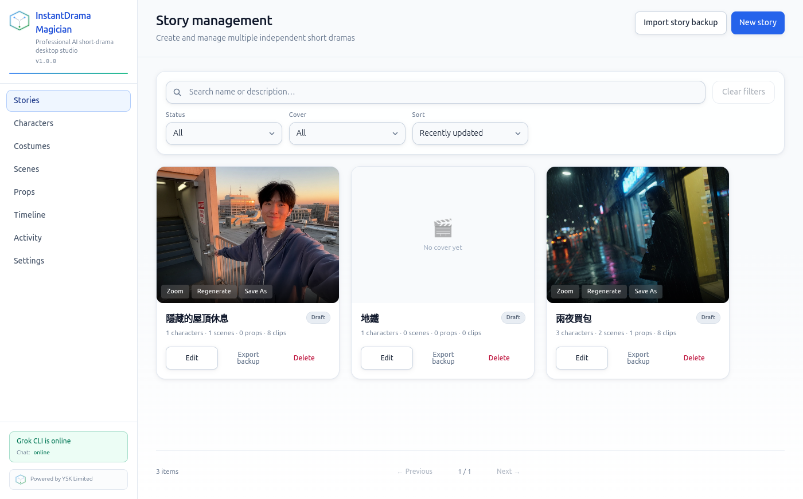
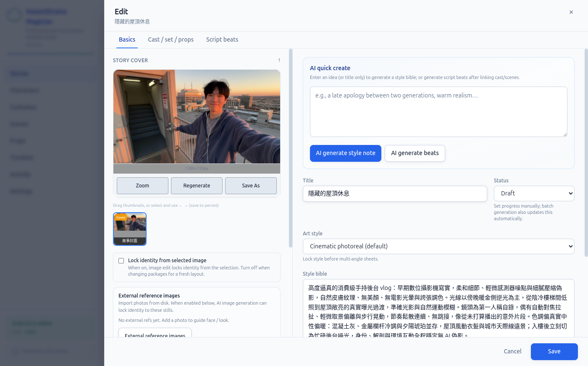
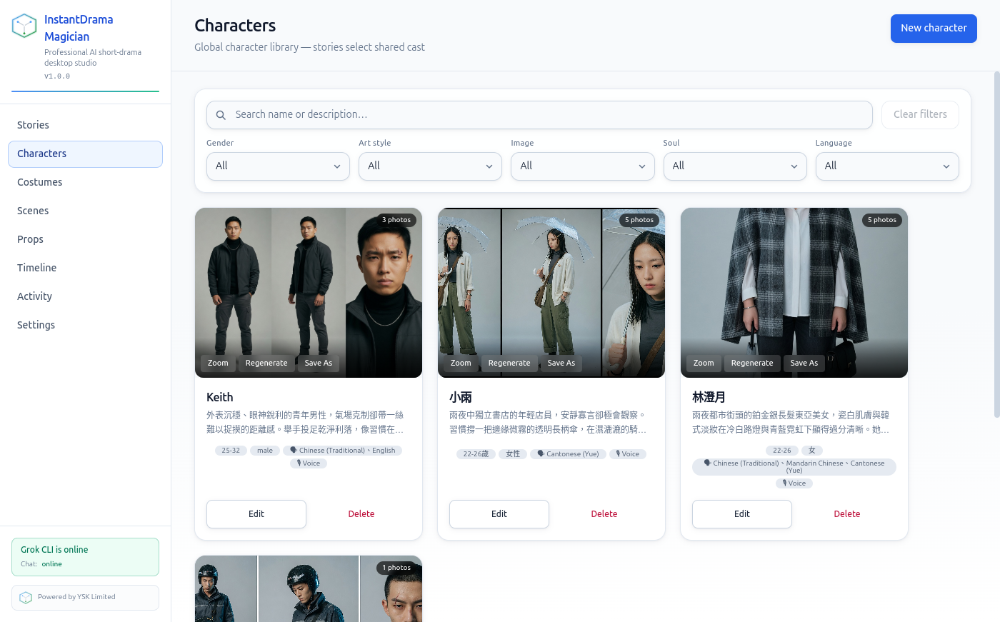
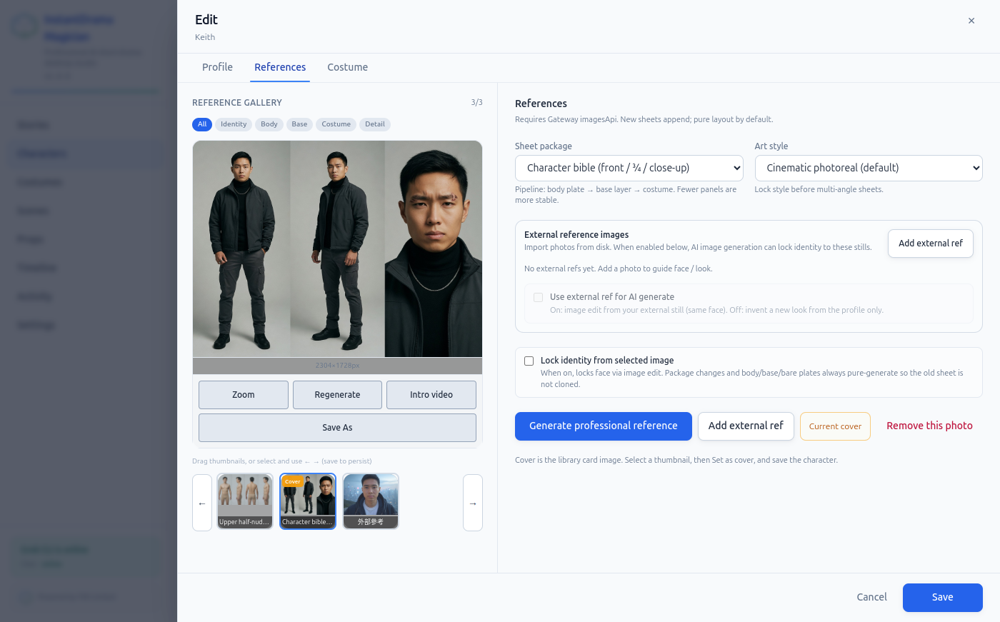
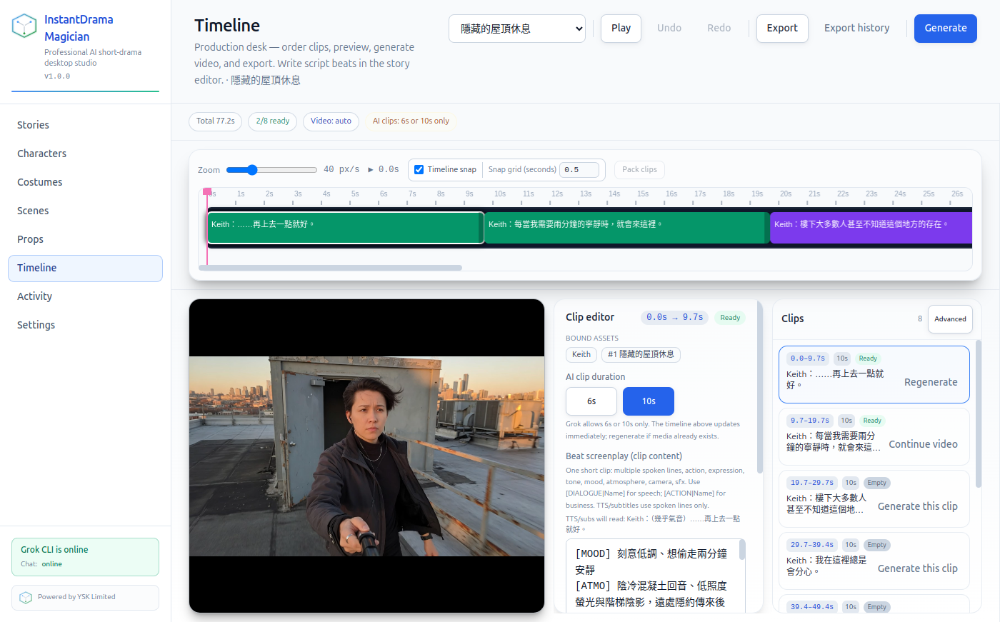
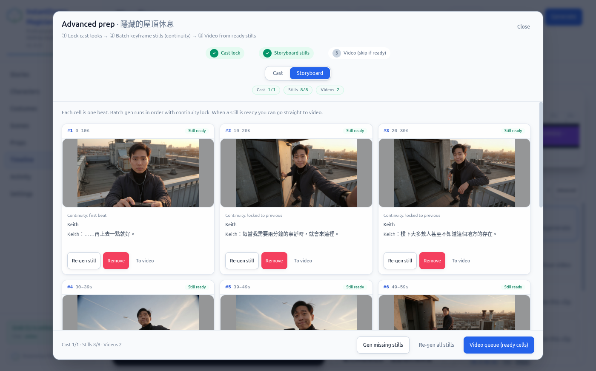

# InstantDrama Magician · 瞬劇魔法師

> **Language:** [English](./README.md) · [中文](./README-ZH.md)

**AI professional short-drama desktop studio**

From one idea to a finished short drama: story → characters / costumes / scenes / props → linear timeline → AI storyboard & video → FFmpeg final export.  
Cross-platform desktop (Electron) + optional browser remote control + full CLI `instant-drama` (**138** channels, same surface as desktop IPC).

| | |
|---|---|
| **Version** | 1.1.2 |
| **Vendor** | YSK Limited |
| **Contact** | [email@ysk.hk](mailto:email@ysk.hk) |
| **License** | MIT |
| **中文** | [README-ZH.md](./README-ZH.md) |

---

## Table of contents

1. [UI screenshots](#ui-screenshots)
2. [Feature overview](#feature-overview)
3. [Desktop app details](#desktop-app-details)
4. [Recommended workflow](#recommended-workflow)
5. [Install & run](#install--run)
6. [CLI (`instant-drama`)](#cli-instant-drama)
7. [Web remote & self-host](#web-remote--self-host)
8. [AI & media providers](#ai--media-providers)
9. [UI languages](#ui-languages)
10. [Data directories & backup](#data-directories--backup)
11. [Architecture](#architecture)
12. [Documentation index](#documentation-index)
13. [Creator](#-creator)
14. [License & contact](#license--contact)

---

## UI screenshots

Screenshots from the real app (`src/assets/screen/`).

### 1. Story management

Multi-project list: covers, status (Draft, etc.), character / scene / prop / clip counts, search & filters, **export backup** / **import story backup**, new story.



### 2. Story editor (Basics)

Story cover, AI quick create (**AI generate style note** / **AI generate beats**), title & status, art style, **Style bible**, external reference images and identity-lock options.



### 3. Character library

Global cast library: multi-image reference sheets, filters (gender / art style / has image / soul / language), zoom / regenerate / save as, edit & delete. Sidebar shows Grok CLI connection status.



### 4. Character references

Professional reference flow: Identity / Body / Base / Costume / Detail gallery, multi-angle **Character bible**, art-style lock, external refs, **Lock identity**, Intro video, set as cover.



### 5. Timeline production desk

Core pipeline: timeline snap, clip list, preview, **Clip editor** (bound assets, 6s/10s AI duration, beat screenplay), per-clip generate/retry, **Generate** / **Export** / Export history, **Advanced** prep entry.



### 6. Advanced prep

Three-step pipeline: **Cast lock → Storyboard stills → Video**. Batch keyframe stills, continuity lock, per-cell re-gen / To video, video queue.



---

## Feature overview

| Area | What you can do |
|------|-----------------|
| **Stories** | Multi-story management, cover AI, style bible, script beats, cast/set/props binding, `.idm.zip` backup import/export |
| **Characters** | Global cast library, soul.md / SoulMD Hub, multi-angle reference sheets, identity lock, external refs, intro video |
| **Costumes** | Wardrobe library, costume swap, wardrobe suggestions, linked to character galleries |
| **Scenes** | Scene copy, plates / looks / atmosphere, scene gallery |
| **Props** | Prop descriptions, master prompts, plate variants |
| **Timeline** | Linear layout, snap/pack, per-clip generate, cancel, retry-failed-only, 6s/10s duration, dialogue & camera tags |
| **Advanced prep** | Cast lock → storyboard stills (continuity) → video from stills |
| **Audio / subtitles** | Optional TTS mix, burn-in dialogue subs, xfade / ducking, aspect-aware export |
| **Activity log** | Generation / export / update events (JSONL) for debugging |
| **Settings** | LLM / image / video providers, diagnostics, FFmpeg, web server, auto-update, support report, legal terms |
| **CLI `instant-drama`** | Local headless or remote invoke; build/open desktop app; OpenClaw / Hermes agents |
| **Web remote** | In-app web server or standalone `instant-drama server`; browser uses the same data |
| **i18n** | 10 UI languages (incl. zh-HK, zh-CN, Arabic RTL, etc.) |
| **Auto-update** | Packaged builds via GitHub Releases (electron-updater) |

---

## Desktop app details

Sidebar: **Stories · Characters · Costumes · Scenes · Props · Timeline · Activity · Settings**.

### Stories

- Create / edit / delete multiple independent short-drama projects  
- Status, cover presence, sort (e.g. recently updated)  
- Cover: Zoom / Regenerate / Save As  
- **Import story backup** / **Export backup** (story-level `.idm.zip`)  
- Edit tabs:  
  - **Basics**: cover, AI quick create, title, status, art style, style bible  
  - **Cast / set / props**: link characters, scenes, props  
  - **Script beats**: scene/dialogue beats for the timeline  

### Characters

- **Global cast library** (stories can share cast)  
- Search and filters: gender, art style, has image, soul, language  
- Multi-image cards; Edit / Delete  
- Edit tabs:  
  - **Profile**: name, description, age, gender, language, voice, etc.  
  - **References**: multi-angle bible (front / ¾ / close-up…), body/base/costume pipeline, external refs, identity lock, generate professional refs, Intro video  
  - **Costume**: bind wardrobe  
- **SoulMD Hub** (soulmd-hub.ysk.hk): index suggestions, import soul.md as character soul  
- Details: [docs/soulmd-hub.md](./docs/soulmd-hub.md) · [docs/soulmd-hub-ZH.md](./docs/soulmd-hub-ZH.md)

### Costumes

- Wardrobe asset library  
- Linked to character costume swap / wardrobe suggest  
- Generation and gallery labels (Identity / Costume, etc.)  

### Scenes

- Scene description and script fields  
- Scene plates, looks, atmosphere  
- Scene gallery and variants  

### Props

- Prop name and description  
- Prop master prompt, plate variants  
- Bound on timeline clips  

### Timeline (main production desk)

- Select current story; **Play** / **Undo** / **Redo**  
- **Generate** batch; **Export** final; **Export history**  
- Total duration, ready count, video mode, AI clips **6s or 10s only**  
- Zoom, **Timeline snap**, snap grid, **Pack clips**  
- **Clip editor**: bind scene/character/prop, duration, beat screenplay (`[MOOD]` / `[ATMO]` / `[DIALOGUE]`, etc.)  
- Per clip: **Generate this clip** / **Regenerate** / **Continue video**  
- Retry failures; cancel generation; retry-failed-only  
- Export options: TTS, burn-in subtitles, xfade, BGM ducking, aspect ratio  

### Advanced prep

Opened from Timeline **Advanced**:

1. **Cast lock** — lock on-screen character looks  
2. **Storyboard stills** — batch keyframes per beat with **continuity** to previous cell  
3. **Video** — queue video when stills are ready (can skip existing video)  

Best when you want continuity locked before video generation.

### Activity

- View local `activity.jsonl`-style events  
- Generation, export, update, support-report trails  
- Helps diagnose API / pipeline issues  

### Settings

| Block | Contents |
|-------|----------|
| **LLM** | OpenAI-compatible; default **Grok Gateway** (e.g. `http://127.0.0.1:3847`); also OpenAI / Custom / **Kimi (Moonshot)**, etc. |
| **Image** | Same as LLM or independent base URL / key / model (incl. Ark **Seedream**) |
| **Video** | `auto` / `http` / `stub`; **Seedance (Volcengine Ark)**, Grok `/v1/videos`, etc.; 6/10s; poll & timeout |
| **Diagnostics** | Test Chat, list models, connection status |
| **FFmpeg** | Hard dependency; optional `FFMPEG_PATH` |
| **Web server** | Enable browser remote, port, token, localhost / LAN |
| **Auto-update** | Check / download / restart (packaged only; skipped in dev) |
| **Support report** | Export diagnostics JSON (**API keys redacted**) |
| **UI language** | See languages below |
| **Legal** | Disclaimer & Acceptable Use Policy (AUP); re-accept when version changes |

---

## Recommended workflow

```text
1) Settings → paste API key → Test Chat
2) Stories → create / AI style note + beats
3) Characters → multi-angle sheet → lock identity
4) Scenes / Props / Costumes → complete assets
5) Timeline → lay out clips, write beat screenplay
6) Advanced prep → stills (continuity) → video
7) Export → final (optional TTS / subtitles)
```

Demo: load a sample story in dev; CLI also has `instant-drama stories seed-demo`.

---

## Install & run

### CLI only (global npm)

```bash
npm install -g instant-drama-magician
instant-drama doctor --json
```

See [CLI (`instant-drama`)](#cli-instant-drama) for full commands. Package name on npm: **`instant-drama-magician`**.

### Packages (end users)

| Platform | Artifacts |
|----------|-----------|
| **Linux / Ubuntu** | `.AppImage`, `.deb` |
| **Windows** | NSIS installer |
| **macOS** | `.dmg` |

Local builds land in `release/`; or download from GitHub Releases.

```bash
# Linux example
sudo dpkg -i release/instant-drama-magician_1.1.2_amd64.deb
# or
./release/InstantDrama\ Magician-1.0.0.AppImage
```

Or via CLI:

```bash
instant-drama build --target installer
instant-drama open
```

### Developer quick start

```bash
# (Recommended) Grok OpenAI-compatible gateway in another terminal
# gctoac start  →  http://127.0.0.1:3847

cd instant-drama-magician
npm install
npx prisma db push
npm run dev
```

1. **Settings** → API key → **Test Chat**  
2. Create or open a story → timeline generate  
3. Export final  

Details: [docs/grok-gateway.md](./docs/grok-gateway.md).

### Common npm scripts

| Command | Description |
|---------|-------------|
| `npm run dev` | Electron development |
| `npm run build` | Compile main / preload / renderer |
| `npm test` | Vitest |
| `npm run dist:linux` / `dist:win` / `dist:mac` | Platform installers |
| `npm run instant-drama -- …` | Run CLI without global link |

---

## CLI (`instant-drama`)

Drive the **full** surface from the shell: local headless runtime or a running web server. For scripts, CI, and **OpenClaw / Hermes** agents.

Command on PATH after global install: **`instant-drama`**.

### Install CLI globally (recommended)

Requires **Node.js 20+**. Package on npm: [instant-drama-magician](https://www.npmjs.com/package/instant-drama-magician).

```bash
npm install -g instant-drama-magician

# Verify
instant-drama --help
instant-drama doctor --json
instant-drama version
```

#### CLI updates (npm)

```bash
instant-drama update              # check registry for a newer version
instant-drama update install --yes   # run: npm install -g instant-drama-magician@latest
```

`instant-drama doctor` also reports npm update status (skip with `IDM_SKIP_UPDATE=1`).

#### Desktop app updates (GitHub Releases)

Packaged installers use **electron-updater**. On launch the app quietly checks for a newer GitHub Release; if one is available you get a **banner + toast**.  
**Settings → App → Updates**: check / download / restart to install.

What you get:

| Binary | Purpose |
|--------|---------|
| `instant-drama` | CLI (only command name; avoids clash with unrelated npm package `idm`) |

Typical usage after global install:

```bash
instant-drama --local stories list --json
instant-drama server start --port 8787
instant-drama channels list --json          # ~138 channels
```

> **Note:** Global install provides the **CLI / headless / web-server** control plane (stories, cast, generation, export helpers, agent tools). Building or opening the **Electron desktop GUI** (`instant-drama build` / `instant-drama open`) still needs a full git clone with `npm install` (devDependencies such as Electron) and a local `release/` tree.

### Install from this repository

```bash
git clone https://github.com/yanshekki/instant-drama-magician.git
cd instant-drama-magician
npm install
npm link                 # puts instant-drama on PATH
# or without link:
npm run instant-drama -- doctor --json
```

### Modes

| Mode | When | Behavior |
|------|------|----------|
| **local** | `--local` or no URL | Operate on `IDM_DATA_DIR` (default `~/.local/share/idm`) |
| **remote** | `--url` / `IDM_URL` | `POST {url}/api/invoke` + Bearer |

### Common commands

```bash
# Diagnostics (channel count should be ~138)
instant-drama doctor --json
instant-drama channels list --json

# Any channel
instant-drama invoke stories:list --json
instant-drama invoke generation:run '["storyId"]' --json

# Domain sugar
instant-drama stories list --json
instant-drama stories create --title "My drama" --json
instant-drama characters list --json
instant-drama characters generate-sheet --args '[{"characterId":"…"}]' --json
instant-drama generation run <storyId> --json
instant-drama settings get --json
instant-drama ai status --json
instant-drama media check-ffmpeg --json

# Desktop lifecycle (macOS · Ubuntu · Windows)
instant-drama build                         # local unpacked
instant-drama build --target installer      # dmg / AppImage+deb / nsis
instant-drama open                          # open packaged app
instant-drama open --dev                    # development mode
instant-drama open --build-if-missing

# Web server
instant-drama server start --port 8787 --data-dir ./data

# Agent tool definitions
instant-drama tools schema --openai > tools.json
```

**Example namespaces:**  
`activity` · `ai` · `app` · `characters` · `costumes` · `diagnostics` · `gateway` · `generation` · `media` · `project` · `props` · `scenes` · `settings` · `shell` · `souls` · `stories` · `support` · `timeline` · `updates` · `videoPrep` · `webServer`

Headless file-dialog substitutes: `IDM_PICK_FILE`, `IDM_SAVE_PATH`.

Full docs: [docs/cli.md](./docs/cli.md) · Agent: [docs/agent-cli.md](./docs/agent-cli.md) · OpenClaw: [`skills/idm/SKILL.md`](./skills/idm/SKILL.md)

---

## Web remote & self-host

### Mode A — built into the desktop app (recommended)

1. Open the Electron desktop app  
2. **Settings → Web server (browser control)**  
3. Enable, copy URL and token  
4. Open in a browser; **shares the same userData** as desktop  

### Mode B — standalone process

```bash
npm run build:web
export IDM_DATA_DIR=./data
export IDM_AUTH_TOKEN='your-long-secret'
export IDM_PORT=8787
export DATABASE_URL="file:${IDM_DATA_DIR}/instant-drama.db"
npx prisma db push
instant-drama server start
# Browser → http://127.0.0.1:8787  paste token
```

Details: [docs/self-host.md](./docs/self-host.md).

---

## AI & media providers

### LLM (chat / script / style)

- Unified **OpenAI-compatible** Chat Completions  
- Default: **Grok CLI Gateway** (port `3847`; legacy port can migrate)  
- Also: OpenAI, custom base URL, **Kimi (Moonshot)**, etc.  

### Image

- Share with LLM or configure independently  
- Gateway images API, Ark **Seedream**, etc. (per settings)  

### Video

| Mode | Behavior |
|------|----------|
| `auto` | Prefer real video API; fall back to stub on failure |
| `http` | Always OpenAI-style `/v1/videos` (or configured provider) |
| `stub` | Color placeholders (no real model) |

- Duration aligned to providers: **6 or 10 seconds only** (Grok-style video)  
- **Seedance (Volcengine Ark)** as a dedicated video provider  
- Settings: poll interval, timeout, retries, concurrency, aspect ratio  

Details: [docs/video-providers.md](./docs/video-providers.md), [docs/grok-gateway.md](./docs/grok-gateway.md).

### FFmpeg

- **Hard dependency**: concat, transitions, mix, burn-in subtitles, export  
- Bundled via **`ffmpeg-static`**; override with `FFMPEG_PATH`  

> **Honest limits:** Look depends on your models and prompts. This tool owns workflow, continuity, and export—not guaranteed “cinema-grade” auto film. Store signing / Notarize needs your certificates.

---

## UI languages

Switch in Settings:

| Code | Language |
|------|----------|
| `zh-HK` | Traditional Chinese (Hong Kong) |
| `zh-CN` | Simplified Chinese |
| `en` | English |
| `es` | Español |
| `hi` | हिन्दी |
| `ar` | العربية (RTL) |
| `pt-BR` | Português (Brasil) |
| `fr` | Français |
| `ja` | 日本語 |
| `ru` | Русский |

---

## Data directories & backup

| Context | Typical path (Linux) |
|---------|----------------------|
| **Packaged desktop** | `~/.config/instant-drama-magician/` |
| **Dev `npm run dev`** | `~/.config/instant-drama-magician-dev/` (isolated from install) |
| **CLI local default** | `~/.local/share/idm` or `IDM_DATA_DIR` |
| **Dev DB (isDev)** | Project `prisma/dev.db` (DB only); media/settings still under userData |

Usually contains: `instant-drama.db`, `settings.json`, `media/`, `logs/`, `exports/`, etc.

**Backup:**

- Story-level: Stories page **Export backup** (`.idm.zip`)  
- Full / diagnostics: app backup + support report (Settings / CLI `support`)  

Wipe packaged user data (**deletes stories and media**):

```bash
rm -rf ~/.config/instant-drama-magician
```

> Installers **do not** ship your test data. Old stories after install usually mean existing local userData on the same machine.

---

## Architecture

| Layer | Tech |
|-------|------|
| Desktop | Electron + electron-vite |
| UI | React 18 + TypeScript + Tailwind |
| Data | SQLite + Prisma |
| Media | FFmpeg; timeline UI |
| Integration | OpenAI-compatible HTTP; Grok Gateway |
| Runtime | Shared `registerAllHandlers` → Electron IPC / Web `/api/invoke` / CLI `instant-drama invoke` |

Details: [docs/architecture.md](./docs/architecture.md).

---

## Documentation index

**Rule:** files **without** `-ZH` are English; files **with** `-ZH` are Chinese. Pairs must match in content.

Full index + canonical facts: **[docs/README.md](./docs/README.md)** · **[docs/README-ZH.md](./docs/README-ZH.md)**

| English | Chinese | Topic |
|---------|---------|--------|
| [docs/README.md](./docs/README.md) | [docs/README-ZH.md](./docs/README-ZH.md) | Docs index + facts |
| [docs/project-brief.md](./docs/project-brief.md) | [docs/project-brief-ZH.md](./docs/project-brief-ZH.md) | Product spec |
| [docs/cli.md](./docs/cli.md) | [docs/cli-ZH.md](./docs/cli-ZH.md) | CLI (138 channels) |
| [docs/agent-cli.md](./docs/agent-cli.md) | [docs/agent-cli-ZH.md](./docs/agent-cli-ZH.md) | Agents / OpenClaw |
| [docs/self-host.md](./docs/self-host.md) | [docs/self-host-ZH.md](./docs/self-host-ZH.md) | Web remote |
| [docs/grok-gateway.md](./docs/grok-gateway.md) | [docs/grok-gateway-ZH.md](./docs/grok-gateway-ZH.md) | Grok Gateway |
| [docs/video-providers.md](./docs/video-providers.md) | [docs/video-providers-ZH.md](./docs/video-providers-ZH.md) | Video / image providers |
| [docs/soulmd-hub.md](./docs/soulmd-hub.md) | [docs/soulmd-hub-ZH.md](./docs/soulmd-hub-ZH.md) | SoulMD Hub |
| [docs/commercial.md](./docs/commercial.md) | [docs/commercial-ZH.md](./docs/commercial-ZH.md) | Releases & updater |
| [docs/release.md](./docs/release.md) | [docs/release-ZH.md](./docs/release-ZH.md) | Release checklist |
| [docs/legal.md](./docs/legal.md) | [docs/legal-ZH.md](./docs/legal-ZH.md) | Legal versioning |
| [docs/testing.md](./docs/testing.md) | [docs/testing-ZH.md](./docs/testing-ZH.md) | Testing |
| [docs/architecture.md](./docs/architecture.md) | [docs/architecture-ZH.md](./docs/architecture-ZH.md) | Architecture |
| [docs/beta.md](./docs/beta.md) | [docs/beta-ZH.md](./docs/beta-ZH.md) | Historical beta |
| [docs/production-ux.md](./docs/production-ux.md) | [docs/production-ux-ZH.md](./docs/production-ux-ZH.md) | Historical UX |
| [docs/rc.md](./docs/rc.md) | [docs/rc-ZH.md](./docs/rc-ZH.md) | Historical RC |
| [skills/idm/SKILL.md](./skills/idm/SKILL.md) | [skills/idm/SKILL-ZH.md](./skills/idm/SKILL-ZH.md) | OpenClaw skill |
| [resources/README.md](./resources/README.md) | [resources/README-ZH.md](./resources/README-ZH.md) | App icons |

---

## 👤 Creator

**Ki (yanshekki)** — Full-stack developer, quant trader, founder of [YSK Limited](https://ysk.hk/).

🌐 [linktr.ee/yanshekki](https://linktr.ee/yanshekki) · 🏢 [ysk.hk](https://ysk.hk/)

### ☕ Support / Donate

If InstantDrama Magician helps your short-drama production workflow, consider buying me a coffee!

| Network | Address |
| --- | --- |
| **EVM** (ETH/BSC/AVAX) | `yanshekki.eth` |
| **NEAR** | `yanshekki.near` |
| **ADA** (Cardano) | `$yanshekki` |

---

## License & contact

- **License:** MIT  
- **Vendor:** YSK Limited  
- **Email:** [email@ysk.hk](mailto:email@ysk.hk)  
- **Repository:** see `package.json` → `repository.url`  

Please attach a **support report** when filing issues (Settings; keys redacted).

---

**InstantDrama Magician** — turn AI short-drama ideas into an editable, exportable, iterable professional workflow.
